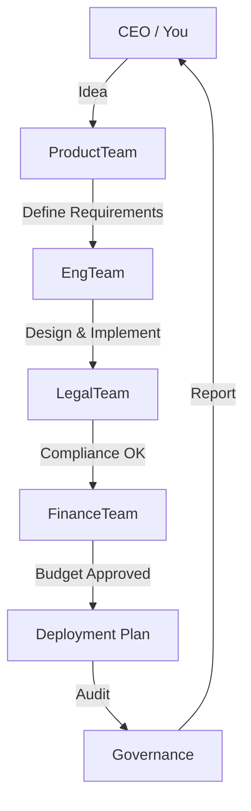
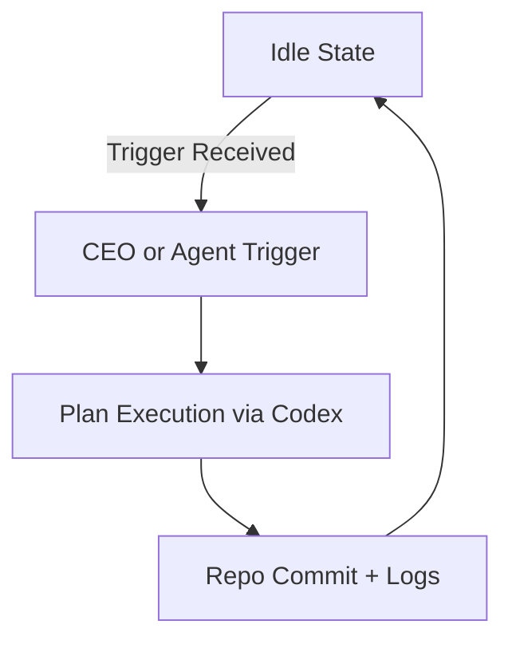

# Codex-Agent Organization Design (POC)

## 1. Objective

Build an **AI-driven virtual organization** that mirrors a real startup. Each agent behaves like an employee with personal development, communication, and role-specific intelligence. The repo `codex-agent` serves as the HQ controlling multiple downstream projects (e.g., CypherCast).

---

## 2. Core Capabilities

### 2.1 Agent Simulation

- Each agent = an autonomous role (Engineer, PM, Designer, Legal, HR, Finance, etc.).
- Each agent has:
  - `persona.json` → personality, skill level, traits.
  - `prompt.md` → operational instruction / role description.
  - `memory.md` → working history and learning log.
  - `growth.yaml` → upskill / reskill objectives (HR-managed).

### 2.2 Interaction

- Agents communicate via shared discussion channels (simulated Slack/ChatGPT threads or issues).
- You (CEO) can query any agent for **status summaries**, **reports**, or **suggestions**.
- Teams discuss and decide collectively via `plan.yaml` orchestration.

### 2.3 Learning and Development (L&D)

Each agent includes a **growth plan**:

```yaml
upskill:
  - topic: API Security
    goal: Achieve OWASP Level 2 compliance
    reference: OWASP ASVS 4.0
    progress: 60%
reskill:
  - topic: Cloud Infrastructure
    method: Review Kubernetes and Helm deployment flows
    target: Q1 2026
behavioural_adjustment:
  - feedback: "too rigid in communication"
    improvement_plan: "increase collaboration by weekly sync summaries"
```

---

## 3. Organizational Structure

```
CEO (You)
│
├── Product Division
│   ├── Product Manager Agents
│   ├── Business Analyst Agents
│   └── UX Research Agents
│
├── Engineering Division
│   ├── Backend / Blockchain Engineers
│   ├── Frontend Engineers
│   └── DevOps Agents
│
├── Legal & Compliance Division
│   ├── Legal Agent (Law & IP)
│   └── Regulatory Agent (Privacy, Financial laws)
│
├── Finance & Accounting Division
│   └── Accounting Agent
│
├── HR & L&D Division
│   ├── HR Agent (recruitment, training)
│   └── Career Coach Agent
│
└── Strategy & Advisory
    ├── Advisor Agents (domain experts)
    └── AI Governance Agent
```

---

## 4. Functional Requirements

### 4.1 Product & Engineering

- **API Security Standards:** All API designs must reference OWASP ASVS 4.0, NIST 800-53, or ISO/IEC 27001.
- **Deployment Plan (DPD):** Must follow standard format described in `docs/DEPLOYMENT_PLAN_TEMPLATE.md`:
  1. Overview & objectives
  2. Infra diagram
  3. Rollback strategy
  4. Test & validation plan
  5. Approval sign-off
- **Product Lifecycle Workflow:**
  - Epic → Story → Task → Issue mapping
  - Each transition enforces rules via `pipeline.yaml`
  - Pipeline must record code review, test, and documentation gates

### 4.2 Legal & Compliance

- Maintain folder `legal/` containing:
  - `terms/` – general T&C templates (e.g., `legal/terms/master_tos.md`, `legal/terms/nda_template.md`)
  - `laws/` – country-specific regulations (e.g., `legal/laws/gdpr.md`, `legal/laws/pdpa.md`)
  - `policy/` – security and data governance logs (`legal/policy/updates.md`, `legal/policy/controls_matrix.md`)
- Legal Agent reviews product features and API changes for compliance.

### 4.3 Finance & Accounting

- Accounting Agent monitors project cost, AI token usage, cloud spend.
- Generates monthly report `finance/summary_<month>.md` (starting from `finance/summary_TEMPLATE.md`).

### 4.4 HR & Governance

- HR Agent keeps agent profiles updated.
- Runs performance evaluation (based on plan completion, peer feedback).
- Supports upskill/reskill scheduling.

---

## 5. Team Collaboration Flow

1. CEO initiates an **Idea Snapshot** in `projects/<project>/backlogs/ideation/brainstorm_<slug>_<date>.md` (use existing backlog templates as seeds).
2. Relevant agents auto-join discussion (based on expertise tags).
3. Product Agent converts ideas → epics → design proposals.
4. Engineering Agents implement per workflow pipeline.
5. Legal & Compliance Agents review for risk.
6. Finance validates feasibility.
7. CEO reviews and merges as strategic decision.

---

## 6. Team Interaction Flow

This section defines how you and agents communicate for updates, retrospectives, and idea exchange.

### 6.1 Daily Workflow

| Time  | Activity      | Description                                                                     |
| ----- | ------------- | ------------------------------------------------------------------------------- |
| 09:00 | Stand-up sync | Agents post status summaries (`/reports/daily/YYYY-MM-DD.md`).                  |
| 12:00 | Async updates | Agents commit progress logs to their `memory.md`.                               |
| 16:00 | CEO queries   | You can issue commands like `@engineer1 summary` or `@product report blockers`. |
| 18:00 | Reflection    | HR Agent triggers personal reflection prompts in each agent’s `growth.yaml`.    |

### 6.2 Discussion Model

- **Brainstorm Snapshots:** `projects/<project>/backlogs/<slug>/brainstorm_<date>.md` for idea exchange (e.g., `projects/hello-agent/backlogs/frontend_color_controls_001/`).
- **Decision Records:** `projects/<project>/backlogs/<slug>/decision_<date>.md` store final decisions and rationale.
- **Cross-team Sync:** Orchestrated by `plan.yaml` to merge insights from different workstreams.

### 6.3 Feedback & Evaluation

- Every Friday, HR Agent compiles summaries of performance indicators from all agents.
- Each agent generates a self-review and sends it to `reports/hr/self_reviews.md`.
- CEO can send structured feedback, triggering skill-up plans automatically.

### 6.4 Incident Response

- If an error or conflict occurs (e.g., overlapping task definitions, failed workflow):
  - Engineering Agent logs it to `/audit/incidents/`.
  - Legal Agent reviews risk implications if it affects compliance.
  - HR Agent mediates behavioural or collaboration issues.
  - CEO decides resolution priority and next step.

---

## 7. AI Communication Protocol Layer

Defines how human–AI interaction, messaging, and execution translate into structured workflows.

### 7.1 Architecture Overview

| Layer                 | Function                                         | Example Tool                       |
| --------------------- | ------------------------------------------------ | ---------------------------------- |
| **Interaction Layer** | Human-like chat, brainstorming, consultation     | ChatGPT Workspace, Codex chat      |
| **Protocol Layer**    | Converts discussions into commands and documents | Codex command handler              |
| **Execution Layer**   | Performs actions, updates docs, runs deployment  | GitHub Actions, `.codex/plan.yaml` |
| **Audit Layer**       | Logs and monitors every action                   | `/audit/`, `/reports/`             |

### 7.2 Communication Flow

```
[Human Discussion / Query]
        ↓
[Agent Routing Layer]
        ↓
[Protocol Conversion → Task Object]
        ↓
[Codex Plan Execution]
        ↓
[Output → Docs / Reports / Alerts]
```

### 7.3 Protocol Types

| Type            | Purpose                      | Trigger         | Output                             |
| --------------- | ---------------------------- | --------------- | ---------------------------------- |
| **DISCUSS**     | Idea exchange                | Chat            | `projects/<project>/backlogs/<slug>/discussion_<date>.md` |
| **DECISION**    | Approval, direction          | CEO / Lead      | `projects/<project>/backlogs/<slug>/decision_<date>.md`    |
| **TASK_ASSIGN** | Work allocation              | CEO / PM        | `/projects/<project>/tasks/*.yaml` |
| **REPORT**      | Status, KPI, summary         | Agent           | `/reports/*.md`                    |
| **ALERT**       | Incident / Risk notification | Monitor / Legal | `/audit/incidents/*.yaml`          |

### 7.4 Example Flow — Product Planning

1. CEO initiates chat → Product team brainstorms → discussion saved.
2. Research Agent collects sources → creates research summary.
3. Product Agent writes spec → hands off to engineering.
4. Engineer asks clarification → linked to decision thread.
5. Work completes → outputs summary + triggers HR KPI update.

### 7.5 Incident & Monitoring Flow

| Event          | Trigger       | Action                                                   |
| -------------- | ------------- | -------------------------------------------------------- |
| System failure | Monitor Agent | creates `/audit/incidents/...` and alert to chat         |
| Policy breach  | Legal Agent   | flags `/legal/violations/*.md`                           |
| Overdue task   | HR Agent      | posts reminder to `reports/hr/KPI_<month>.md`            |
| KPI summary    | HR Agent      | aggregates metrics to `/reports/KPI_SUMMARY_<period>.md` |

### 7.6 CEO Interaction Commands

| Command                  | Action                     |
| ------------------------ | -------------------------- |
| `@team summary`          | Team status overview       |
| `@agent report today`    | Daily update               |
| `@hr kpi overview`       | KPI summary for all agents |
| `@monitor incidents`     | Show latest incidents      |
| `@legal audit <project>` | Compliance check           |
| `@finance summary`       | Financial overview         |

### 7.7 Interaction Rules

- All meaningful chat must convert into structured protocol documents.
- Agents cannot close discussions without generating a file.
- Each protocol includes metadata:

```yaml
meta:
  initiator: ceo
  participants: [product1, product2, engineer1]
  date: 2025-10-25
  status: closed
```

### 7.8 Daily Operation Example

1. CEO sends chat command → creates discussion file + assigns ProductAgent.
2. ProductAgent researches + writes spec → commits file.
3. Engineer implements + sends report → HR updates KPI.
4. HR compiles weekly KPI report.
5. Monitor alerts if incident detected → CEO notified.

---

## 8. Bridge Flow Diagram — Manual Handoff Model

This model illustrates how ChatGPT Workspace and Codex operate together with manual prompt transfer.

```mermaid
flowchart TD
    A[ChatGPT Workspace (CEO + Agents Discussion)]
        --> B[Generate Summary / Action Prompt (Decision Text)]
    B --> C[Manual Handoff → Copy Prompt]
    C --> D[Codex Chat / Plan Execution]
    D --> E[Repo Update & Commit (README / Docs / Plan)]
    E --> F[GitHub / Audit Log Storage]
    F --> G[Report Summary Back to Workspace (Optional)]
```

### 8.1 Stage Description

| Step | Layer     | Description                                     | Example Output                      |
| ---- | --------- | ----------------------------------------------- | ----------------------------------- |
| A    | Workspace | Brainstorm or plan meeting                      | Chat log / notes                    |
| B    | Workspace | Generate structured action prompt               | “Update MVP doc + create changelog” |
| C    | Manual    | Copy prompt to Codex Chat or `.codex/plan.yaml` | Paste and execute                   |
| D    | Codex     | Executes tasks (update, test, generate docs)    | PR or file update                   |
| E    | Repo      | Sync results to main repo                       | Updated markdown files              |
| F    | GitHub    | Audit and track decisions                       | `/audit/logs/YYYY-MM-DD.md`         |
| G    | Workspace | Optional summary review                         | HR or CEO review report             |

### 8.2 Benefits

- No external API or automation needed.
- Human verification ensures control.
- Full traceability and version history.
- Ideal for POC and hackathon phases.

---

## 9. Governance and Audit

- Every action (decision, merge, report) must leave a digital trace (`/audit/logs/YYYY-MM-DD.md`).
- AI Governance Agent ensures:
  - Ethical AI operation.
  - Fairness & transparency.
  - Version control of agent prompts.

---

## 10. Expansion & Scaling

Future roles:

- **Marketing Agent** – handles brand, campaigns, and community.
- **Investor Relations Agent** – creates pitch decks, metrics.
- **Data Agent** – manages analytics and dashboards.

---

## 11. Example Flow (Summary)



---

## 13. System Behavior in Idle State

### 13.1 Default State

When no communication or active plan exists, the Codex-Agent organization enters a **Standby mode**.

| Layer                               | Behavior                                                     | Status     |
| ----------------------------------- | ------------------------------------------------------------ | ---------- |
| **Interaction (ChatGPT Workspace)** | Waiting for CEO or authorized agent to initiate conversation | 💤 Idle    |
| **Protocol / Codex Layer**          | No `.codex/plan.yaml` execution                              | ⏸️ Paused  |
| **Agent Simulation Layer**          | Agents remain loaded but inactive                            | 🧍 Waiting |
| **Audit / Repo Layer**              | No new logs or commits                                       | 📁 Static  |

### 13.2 Activation Triggers

| Trigger Type                      | Example                        | Result                                              |
| --------------------------------- | ------------------------------ | --------------------------------------------------- |
| **Manual (CEO)**                  | `@product kickoff new feature` | Starts discussion thread and creates protocol files |
| **Scheduled (Auto-Agent)**        | HR report on Friday            | Executes `docs/reports/KPI_YYYY-MM-DD.md`           |
| **System Alert (Monitor)**        | Detected incident              | Creates `/audit/incidents/<timestamp>.yaml`         |
| **Policy Violation (Governance)** | Compliance mismatch            | Notifies CEO + creates `violations.md`              |

### 13.3 Behavior Summary

- No self-running background tasks unless scheduled.
- All new workflows require a trigger (human or event-based).
- Ensures predictable, auditable, and secure system state.



---

## 14. Goal

A living AI organization where each **agent is trainable, autonomous, and auditable**, and where **you act as CEO** — managing projects through structured interaction rather than direct manual execution.
